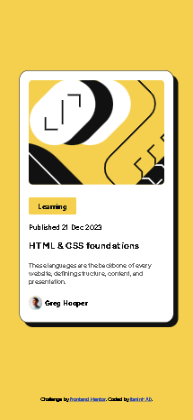

# Frontend Mentor - Blog preview card solution

This is a solution to the [Blog preview card challenge on Frontend Mentor](https://www.frontendmentor.io/challenges/blog-preview-card-ckPaj01IcS). Frontend Mentor challenges help you improve your coding skills by building realistic projects. 

## Table of contents

- [Overview](#overview)
  - [The challenge](#the-challenge)
  - [Screenshot](#screenshot)
  - [Links](#links)
- [My process](#my-process)
  - [Built with](#built-with)
  - [What I learned](#what-i-learned)
  - [Continued development](#continued-development)
  - [Useful resources](#useful-resources)
- [Author](#author)

## Overview

### The challenge

### Screenshot

-Desktop Preview: 
-Mobile Preview: 

### Links

- Solution URL: [Add solution URL here](https://your-solution-url.com)
- Live Site URL: [Add live site URL here](https://your-live-site-url.com)

## My process

### Built with

- Semantic HTML5 markup
- CSS custom properties
- Flexbox
- Mobile-first workflow

### What I learned

This project helped me understand the some of the various viewport values. It showed me how essential it is to use the various viewport  values when creating web content.

I learned that using these viewport values can make websites more responsive to pages without necessarily writing any media queries. It also helps to ensure consistent sizing across devices which maintains visual balance and user experience across their devices

Overall, this project greatly expanded my knowledge of web development best practices and taught me more about how different viewport units work. It empowered me to create better and more responsive websites.

### Continued development

I would like to improve my code for more responsiveness across all devices, so that my website does not look messy. This will help me create better and more user-friendly websites.

### Useful resources

- [DEV Community](https://dev.to/frehner/css-vh-dvh-lvh-svh-and-vw-units-27k4) - This article gave me a complete theory on the viewport units. I really liked it and will use it going forward.I'd recommend it to anyone still learning this concept.
- [Youtube](https://www.youtube.com) - This helped me get to know how these viewport units are applied in projects. I'd recommend it to anyone still learning this concept.

## Author

- Website - [Banini-AD](https://www.your-site.com).
- Frontend Mentor - [@Banini-AD](https://www.frontendmentor.io/profile/Banini-AD).
